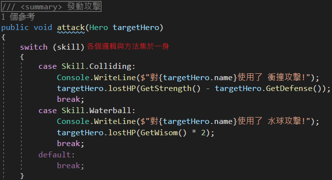
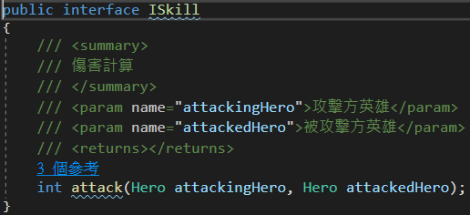
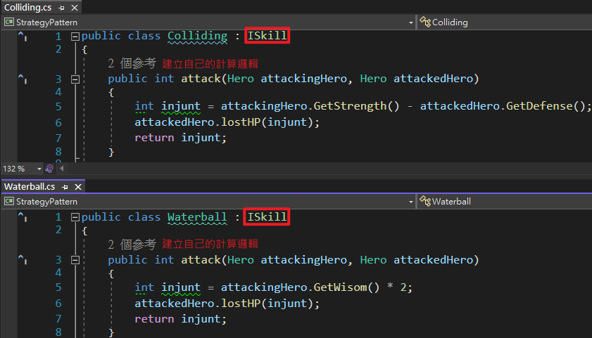
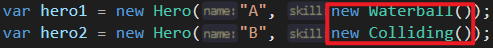
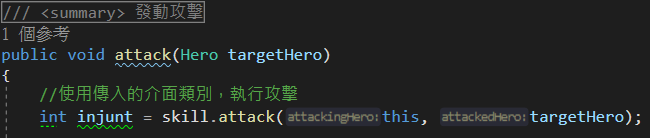

# Strategy Pattern 策略模式

## 使用情境

當一個物件可能被給予多種邏輯，使用判斷式包含著各類邏輯

## 架構

1. 使用interface(介面)將各邏輯建立成獨立一個類別物件
   

2. 在獨立出來的類別，建立計算邏輯的方法
   

3. 建構子時不傳入名稱或代號，改成傳入物件
   

4. 執行動作時，直接執行類的的方法!
   

## 優點

1. 邏輯獨立於各類別，才不會出現龐大的程式碼集於一身(能力越大責任越大?😮)
2. 改變傳入的類別就可以直接切換運算邏輯

## 缺點

1. 方法會分散在各個類別裡面，導致檔案較多，需要較好的專案分類規劃
